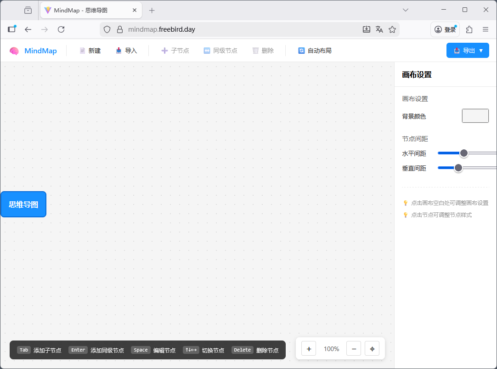

# MindMap App

一个基于 Vue 3 + TypeScript + Vite 的轻量思维导图编辑器，支持节点创建/编辑/拖拽/折叠、自动布局、样式面板，以及 JSON/PNG 的导出与导入，适合作为教学演示或二次开发的可扩展组件。

[English](README_en.md) | 简体中文

**主要特性**
- 节点增删改、拖拽移动与折叠/展开
- 自动布局（树状布局）和画布缩放/平移/居中
- 右侧样式面板：节点样式与画布配置
- JSON 导入/导出、PNG 导出（基于 html2canvas）

**技术栈**
- Vue 3 + TypeScript
- Vite（开发与构建）
- html2canvas（PNG 导出）



## 快速开始
克隆项目：

```bash
git clone https://github.com/Suuuuulan/mindmap-app.git

cd .\mindmap-app\
```

安装依赖并启动开发服务器：

```bash
npm install
npm run dev
```

构建与预览：

```bash
npm run build
npm run preview
```

> 建议 Node 版本：20+

## 项目结构（简要）
- `index.html`：应用入口 HTML
- `src/main.ts`：Vue 应用挂载入口
- `src/App.vue`：根组件，组合工具栏、画布与样式面板
- `src/components/`：核心 UI 组件（`MindMapCanvas.vue`、`MindMapNode.vue`、`Toolbar.vue`、`StylePanel.vue` 等）
- `src/composables/`：组合式钩子（`useMindMap.ts`、`useExport.ts`、`useKeyboard.ts`）
- `src/types/index.ts`：类型定义
- `public/`：静态资源

## 主要组件与开发者提示
- `MindMapCanvas`：画布渲染与节点/连线绘制，处理缩放、平移与拖拽交互。
- `MindMapNode`：单节点展示与编辑控件，响应选中/编辑/折叠操作。
- `Toolbar`：提供新建/导入/导出/添加/删除/自动布局等操作按钮。
- `StylePanel`：编辑所选节点样式与画布配置。

组合式函数（概要）：
- `useMindMap`：核心状态管理与操作集合（root、selectedNode、addChild、addSibling、deleteNode、autoLayout、zoomCanvas 等）。
- `useExport`：提供 JSON 导出/导入与 PNG 导出的功能（使用 html2canvas）。
- `useKeyboard`：全局键盘快捷键处理（如 Tab/Enter/Delete/箭头导航等）。

类型说明：核心类型位于 `src/types/index.ts`，包含节点结构（node）、样式（NodeStyle）与导出数据格式。

## 导出 / 导入 注意事项
- PNG 导出由 `html2canvas` 生成，大图或复杂图形可能受浏览器内存限制；导出失败时可尝试缩放或简化节点样式。
- JSON 导入应与应用导出的格式兼容（导入操作会重置当前画布数据）。

## 开发与扩展建议
- 组件已按职责拆分，可在 `src/components` 中替换或增强单个组件以扩展功能。
- `useMindMap` 暴露了大部分业务 API，便于在外部调用或进行单元测试。

## 许可证
本项目采用 GNU General Public License v3.0（GPL-3.0）许可，详见项目根目录的 `LICENSE` 文件。

